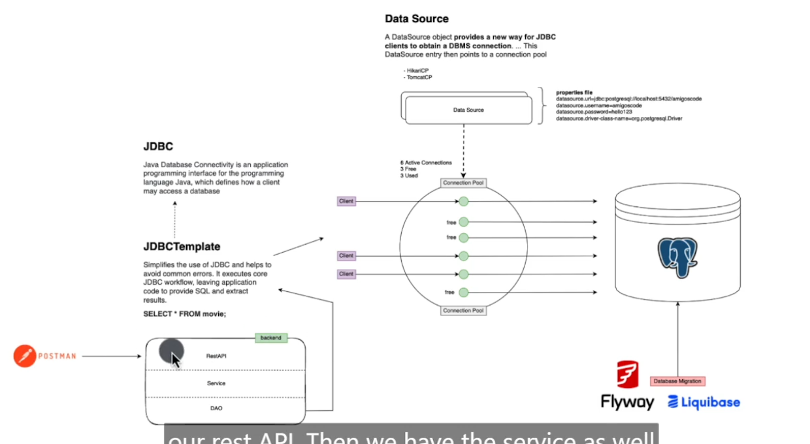
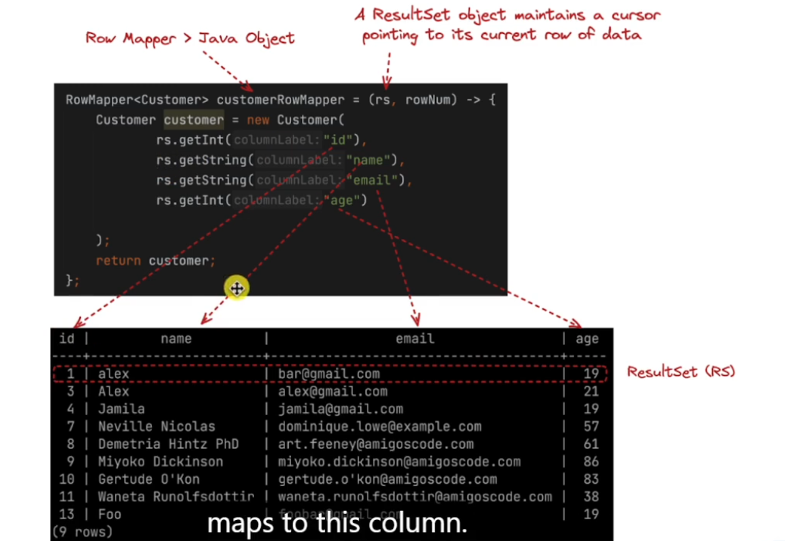

To install JDBC template
go to pom.xml
```xml
<dependency>
    <groupId>org.springframework.boot</groupId>
    <artifactId>spring-boot-starter-data-jdbc</artifactId>
</dependency>
```
to open postgress in docker
```shell
docker exec  -it postgres bash
```
Once the postgres is open.OPen the database
```shell
psql -U philani
```
```shell
\l
```
to drop a table
```shell
drop database customer;
#This fail because the database customer is being used by other users
```

# Database Migration
- Flyway
- Liquibase

## Flyway
```xml


<dependency>
    <groupId>org.flywaydb</groupId>
    <artifactId>flyway-core</artifactId>
</dependency>
```

Under resource create a new directory
and under db create Migration

## Applian
 Under resourse create a new Directory called DB. please refer to the resouce folder
 
create file `V1__Initial_Setup.sql`

When i start the application the migration will happen
Let say we want to apply `V2_Customer_Table.sql` when have to write the query and then apply the migration.
To apply new changes we have to create new version of migration


let transform `Customer.java` into a database schema
Make sure that migration is empty so create `V1__Initial_Setup.sql`
```sql
CREATE TABLE customer(
    id BIGSERIAL PRIMARY KEY ,
    name TEXT NOT NULL,
    email TEXT NOT NULL,
    age INT NOT NULL 
                     
);

```
go to postgres to inspect the database

```bash
\d customer
INSERT INTO customer (name,email,age) VALUES ('foo','bar@gmail.com',19);

```
  

## CustomerJDBC
```java

package com.amigoscode.customer;

import org.springframework.jdbc.core.JdbcTemplate;
import org.springframework.stereotype.Repository;

import java.util.List;
import java.util.Optional;

@Repository("jdbc")
public class CustomerJDBCDataAccessService implements CustomerDao {

    private final JdbcTemplate jdbcTemplate;
    // From string framework
    private final CustomerRowMapper customerRowMapper;

    public CustomerJDBCDataAccessService(JdbcTemplate jdbcTemplate,
                                         CustomerRowMapper customerRowMapper) {
        this.jdbcTemplate = jdbcTemplate;
        this.customerRowMapper = customerRowMapper;
    }

    @Override
    public List<Customer> selectAllCustomers() {
        var sql = """
                SELECT id, name, email, password, age, gender, profile_image_id
                FROM customer
                LIMIT 1000
                """;

        return jdbcTemplate.query(sql, customerRowMapper);
    }

    @Override
    public Optional<Customer> selectCustomerById(Integer id) {
        var sql = """
                SELECT id, name, email, password, age, gender, profile_image_id
                FROM customer
                WHERE id = ?
                """;
        return jdbcTemplate.query(sql, customerRowMapper, id)
                .stream()
                .findFirst();
    }

    @Override
    public void insertCustomer(Customer customer) {
        var sql = """
                INSERT INTO customer(name, email, password, age, gender)
                VALUES (?, ?, ?, ?, ?)
                """;
        int result = jdbcTemplate.update(
                sql,
                customer.getName(),
                customer.getEmail(),
                customer.getPassword(),
                customer.getAge(),
                customer.getGender().name()
        );

        System.out.println("insertCustomer result " + result);
    }

    @Override
    public boolean existsCustomerWithEmail(String email) {
        var sql = """
                SELECT count(id)
                FROM customer
                WHERE email = ?
                """;
        Integer count = jdbcTemplate.queryForObject(sql, Integer.class, email);
        return count != null && count > 0;
    }

    @Override
    public boolean existsCustomerById(Integer id) {
        var sql = """
                SELECT count(id)
                FROM customer
                WHERE id = ?
                """;
        Integer count = jdbcTemplate.queryForObject(sql, Integer.class, id);
        return count != null && count > 0;
    }

    @Override
    public void deleteCustomerById(Integer customerId) {
        var sql = """
                DELETE
                FROM customer
                WHERE id = ?
                """;
        int result = jdbcTemplate.update(sql, customerId);
        System.out.println("deleteCustomerById result = " + result);
    }

    @Override
    public void updateCustomer(Customer update) {
        if (update.getName() != null) {
            String sql = "UPDATE customer SET name = ? WHERE id = ?";
            int result = jdbcTemplate.update(
                    sql,
                    update.getName(),
                    update.getId()
            );
            System.out.println("update customer name result = " + result);
        }
        if (update.getAge() != null) {
            String sql = "UPDATE customer SET age = ? WHERE id = ?";
            int result = jdbcTemplate.update(
                    sql,
                    update.getAge(),
                    update.getId()
            );
            System.out.println("update customer age result = " + result);
        }
        if (update.getEmail() != null) {
            String sql = "UPDATE customer SET email = ? WHERE id = ?";
            int result = jdbcTemplate.update(
                    sql,
                    update.getEmail(),
                    update.getId());
            System.out.println("update customer email result = " + result);
        }
    }

    @Override
    public Optional<Customer> selectUserByEmail(String email) {
        var sql = """
                SELECT id, name, email, password, age, gender, profile_image_id
                FROM customer
                WHERE email = ?
                """;
        return jdbcTemplate.query(sql, customerRowMapper, email)
                .stream()
                .findFirst();
    }

    @Override
    public void updateCustomerProfileImageId(String profileImageId,
                                             Integer customerId) {
        var sql = """
                UPDATE customer
                SET profile_image_id = ?
                WHERE id = ?
                """;
        jdbcTemplate.update(sql, profileImageId, customerId);
    }
}

```

