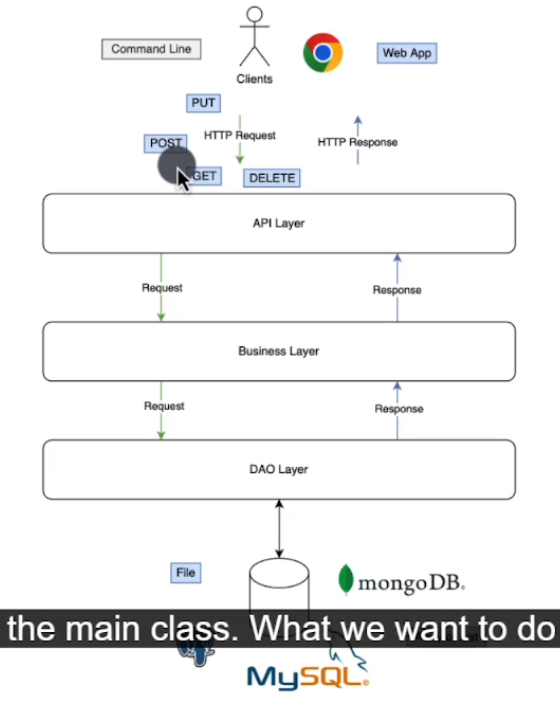

# Spring Boot Example

## Configuring Embedded Web Server

Create a application.yml file on resources


Let say we want to a port
```yaml
server:
  port: 8000
```

Now let say you want to build a Spring boot application without a webserver. But you dont want to do this

```yaml
spring:
  main:
    web-application-type: none

```
The defualt is 
```yaml
spring:
  main:
    web-application-type: servlet

```


## Hello Internet

To build a basic hello world
Go to SpringBootExampleApplication 

create a function called greet
but and annotation @GetMapping()
Also remember that have you have to add @RestController so that each method you add is expose as Rest Endpoints

```java
import org.springframework.boot.SpringApplication;
import org.springframework.boot.autoconfigure.SpringBootApplication;
import org.springframework.web.bind.annotation.GetMapping;
import org.springframework.web.bind.annotation.RestController;

@SpringBootApplication
@RestController
public class Main {
    public static void main(String[] args) {
        SpringApplication.run(Main.class,args);
    }

    @GetMapping("/")
    public String greet() {
        return "Hello";
    }
}
```

## Spring Web MVC
If you want to return json you have to use classes
e.g

```java
import org.springframework.boot.autoconfigure.SpringBootApplication;
import org.springframework.web.bind.annotation.GetMapping;
import org.springframework.web.bind.annotation.RestController;

@SpringBootApplication
@RestController
public class Main {
    public static void main(String[] args) {
        SpringApplication.run(Main.class, args);
    }

    @GetMapping("/greet")
    public GreetResponse greet()
    {
        return new GreetResponse("Hello");
    }
    
    // record is a spacial class
    record GreetResponse(String greet)
    {
        
    }
}
```
The equvalent of record GreetResponse

```java
import org.springframework.boot.autoconfigure.SpringBootApplication;
import org.springframework.web.bind.annotation.GetMapping;
import org.springframework.web.bind.annotation.RestController;

import java.util.Objects;

@SpringBootApplication
@RestController
public class Main {
    public static void main(String[] args) {
        SpringApplication.run(Main.class, args);
    }

    @GetMapping("/greet")
    public GreetResponse greet() {
        return new GreetResponse("Hello");
    }


    class GreetResponse {
        public final String greet;

        public GreetResponse(String greet) {
            this.greet = greet;
        }
//        Having a getter is importence so that we get the correct value from the constructor
        public String getGreet() {
            return greet;
        }

        @Override
        public int hashCode() {
            return Objects.hashCode(greet)
            ;
        }

        @Override
        public String toString() {
            return "GreetResponse{" + "greet=" + this.greet + '\'' + '}';
        }

        @Override
        public boolean equals(Object obj) {
            if (this == obj) return true;
            if (obj == null || obj.getClass() != this.getClass()) return false;
            GreetResponse other = (GreetResponse) obj;
            return Objects.equals(greet, other);
        }
    }
}
```


# Let create our first model
We going to use a `JPA` and use `Beans`

```java
import java.util.Objects;

static class Customer {
    private Integer id;
    private String name;
    private String email;
    private Integer age;

    public Customer(Integer id, String name, String email, Integer age) {
        this.id = id;
        this.name = name;
        this.email = email;
        this.age = age;
    }

    public Customer() {
        super();
    }

    public Integer getAge() {
        return age;
    }

    public Integer getId() {
        return id;
    }

    public String getEmail() {
        return email;
    }

    public String getName() {
        return name;
    }

    public void setAge(Integer age) {
        this.age = age;
    }

    public void setEmail(String email) {
        this.email = email;
    }

    public void setId(Integer id) {
        this.id = id;
    }

    public void setName(String name) {
        this.name = name;
    }

    @Override
    public int hashCode() {
        return Objects.hash(id,name,email,age);
    }


    @Override
    public boolean equals(Object obj) {
        if (this == obj) return true;
        if (obj == null || getClass() != obj.getClass()) return false;
        Customer customer = (Customer) obj;


        return Objects.equals(id,customer.id) && Objects.equals(name,customer.name)
        ;
    }


    @Override
    public String toString() {
        return "Customer{"+
                "id="+id+
                ", name='"+name+'\''+
                "email='"+email+'\''+
                ", age="+age+
                '}'
                ;
    }

}
```

# Let Create a database 
Where we going to store customers
We are going to use List first

```java
import org.springframework.boot.autoconfigure.SpringBootApplication;
import org.springframework.web.bind.annotation.*;

@SpringBootApplication
@RestController
public class Main {
    //Our db for now
    private static List<Customer> customers;

    static {
        customers = new ArrayList<>();
        Customer Zamanguni = new Customer(1, "Zamanguni", "iforgotpassword@yahooo.com", 22);
        customers.add(Zamanguni);
        Customer Njabulo = new Customer(2, "Njabulo", "iamLuckyBoyJackson@gmail.com", 16);
        customers.add(Njabulo);


    }

    public static void main(String[] args) {
        SpringBootApplication.run(Main.class, args);

    }

    //Since we want to handle htpp get request we have to Use RestController for the endpoint and annotate the function with GetMapping
    /*@RequestMapping(path = "api/v1/customer", method = RequestMethod.GET)*/
    //The above method RequestMapping is the same as GetMapping
    @GetMapping("api/v1/customers")
    public  List<Customer> getCustomers() {
        return customers;
    }

    //Using Path variable
    @GetMapping("api/v1/customers/{customerId}")
    public Customer getCustomer(@PathVariable("customerId") Integer customerId){

        
        return customers.stream().filter
                (customer ->customer.id.equals(customerId)).
                findFirst()
                .orElseThrow(
                        () -> new IllegalArgumentException("customer with %d not found".formatted(customerId)));
    }

}
```
//We need to setup a method that will intercept a Htppt request then return a the list


# Let break our program so far such that its follows n-tier architecture



Let create a new Package (Customer) and inside of this Customer package
we will have a customer class
```java

import java.util.Objects;

public class Customer {
    private Integer id;
    private String name;
    private String email;
    private Integer age;

    public Customer(Integer id, String name, String email, Integer age) {
        this.id = id;
        this.name = name;
        this.email = email;
        this.age = age;
    }

    public Customer() {
        super();
    }

    public Integer getAge() {
        return age;
    }

    public Integer getId() {
        return id;
    }

    public String getEmail() {
        return email;
    }

    public String getName() {
        return name;
    }

    public void setAge(Integer age) {
        this.age = age;
    }

    public void setEmail(String email) {
        this.email = email;
    }

    public void setId(Integer id) {
        this.id = id;
    }

    public void setName(String name) {
        this.name = name;
    }

    @Override
    public int hashCode() {
        return Objects.hash(id,name,email,age);
    }


    @Override
    public boolean equals(Object obj) {
        if (this == obj) return true;
        if (obj == null || getClass() != obj.getClass()) return false;
        Customer customer = (Customer) obj;


        return Objects.equals(id,customer.id) && Objects.equals(name,customer.name)
        ;
    }


    @Override
    public String toString() {
        return "Customer{"+
                "id="+id+
                ", name='"+name+'\''+
                "email='"+email+'\''+
                ", age="+age+
                '}'
                ;
    }

}
```
Let  Create an interface on our Customer package. this is called `CustomerDAO`\

```java
import java.util.Optional;

public interface CustomerDAO {
    List<Customer> selectAllCustomers();

    Optional<Customer> selectCustomerById(Integer customerId);
}
```
Now let have a class called `CustomerDataAccessService`

```java
import org.springframework.stereotype.Repository;

import java.util.Optional;

@Repository
public class CustomerDataAccessService implements CustomerDao {
//Any class with Dao we use @repository controller
    //Our db for now
    private static List<Customer> customers;

    static {
        customers = new ArrayList<>();
        Customer Zamanguni = new Customer(1, "Zamanguni", "iforgotmypassword@yahooo.com", 22);
        customers.add(Zamanguni);
        Customer Njabulo = new Customer(2, "Njabulo", "iamLuckyBoyJackson@gmail.com", 16);
        customers.add(Njabulo);


    }

    @Override
    public List<Customer> selectAllCustomers() {
        return customers;
    }

    @Override
    public Optional<Customer> selectCustomerById(Integer customerId) {
        return customers.stream().filter
                        (customer -> customer.getId().equals(customerId)).
                findFirst();
    }

}
```

Classes that handles http request are called `Controller`
So let create Customer Controller

```java
import org.springframework.web.bind.annotation.RestController;

@RestController
public class CustomerController {
    private final CustomerService customerService;
    
    
    public CustomerController(CustomerService customerService){
        this.customerService=customerService;
    }
    
    //Since we want to handle htpp get request we have to Use RestController for the endpoint and annotate the function with GetMapping
    /*@RequestMapping(path = "api/v1/customer", method = RequestMethod.GET)*/
    //The above method RequestMapping is the same as GetMapping
    @GetMapping("api/v1/customers")
    public List<Customer> getCustomers() {
        return customerService.getAllCustomers();
    }

    //Using Path variable
    @GetMapping("api/v1/customers/{customerId}")
    public Customer getCustomer(@PathVariable("customerId") Integer customerId) {
        return customerService.getCustomer(customerId);
    }
}

```

Our Main which is outside of the customer package

```java
import org.springframework.boot.SpringApplication;

public class Main {
    public static void main(String[] args) {
        SpringApplication.run(Main.class,args);
    }
}
```

We are missing the business layer. which perform the business logic .from the Customer package

Let create CustomerService class from the customer package

```java
import org.springframework.stereotype.Component;
import org.springframework.stereotype.Service;

@Service
public class CustomerService {
    private final CustomerDao customerDao;

    public CustomerService(CustomerDao customerDao) {
        this.customerDao = customerDao;
    }

    public List<Customer> getAllCustomer() {
        return customerDao.selectAllCustomers();
    }

    public Customer getCustomer(Integer CustomerId) {
        return customerDao.selectAllCustomerById(CustomerId)
                .orElseThrow(
                        () -> new IllegalArgumentException("customer with %d not found".formatted(customerId)));

    }
}
```

Since Spring is dependency injection  framework
we don't have to say on `Main` class

we have concept of `Beans`


```java
import org.springframework.boot.SpringApplication;

public static void main(String[] args) {
    CustomerService customerService = new CustomerService(new CustomerDataAccessService());
    CustomerController customerController = new CustomerController(customerService);
    SpringApplication.run(Main.class,args);
}

```

# Application Context and Beans

