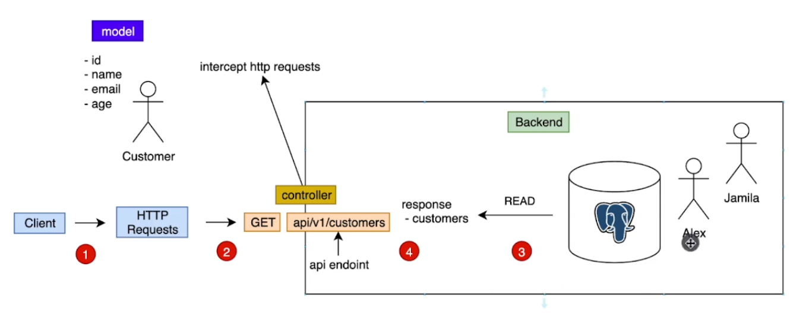

# Spring Boot Example

## Configuring Embedded Web Server

Create a application.yml file on resources


Let say we want to a port
```yaml
server:
  port: 8000
```

Now let say you want to build a Spring boot application without a webserver. But you dont want to do this

```yaml
spring:
  main:
    web-application-type: none

```
The defualt is 
```yaml
spring:
  main:
    web-application-type: servlet

```


## Hello Internet

To build a basic hello world
Go to SpringBootExampleApplication 

create a function called greet
but and annotation @GetMapping()
Also remember that have you have to add @RestController so that each method you add is expose as Rest Endpoints

```java
import org.springframework.boot.SpringApplication;
import org.springframework.boot.autoconfigure.SpringBootApplication;
import org.springframework.web.bind.annotation.GetMapping;
import org.springframework.web.bind.annotation.RestController;

@SpringBootApplication
@RestController
public class Main {
    public static void main(String[] args) {
        SpringApplication.run(Main.class,args);
    }

    @GetMapping("/")
    public String greet() {
        return "Hello";
    }
}
```

## Spring Web MVC
If you want to return json you have to use classes
e.g

```java
import org.springframework.boot.autoconfigure.SpringBootApplication;
import org.springframework.web.bind.annotation.GetMapping;
import org.springframework.web.bind.annotation.RestController;

@SpringBootApplication
@RestController
public class Main {
    public static void main(String[] args) {
        SpringApplication.run(Main.class, args);
    }

    @GetMapping("/greet")
    public GreetResponse greet()
    {
        return new GreetResponse("Hello");
    }
    
    // record is a spacial class
    record GreetResponse(String greet)
    {
        
    }
}
```
The equvalent of record GreetResponse

```java
import org.springframework.boot.autoconfigure.SpringBootApplication;
import org.springframework.web.bind.annotation.GetMapping;
import org.springframework.web.bind.annotation.RestController;

import java.util.Objects;

@SpringBootApplication
@RestController
public class Main {
    public static void main(String[] args) {
        SpringApplication.run(Main.class, args);
    }

    @GetMapping("/greet")
    public GreetResponse greet() {
        return new GreetResponse("Hello");
    }


    class GreetResponse {
        public final String greet;

        public GreetResponse(String greet) {
            this.greet = greet;
        }
//        Having a getter is importence so that we get the correct value from the constructor
        public String getGreet() {
            return greet;
        }

        @Override
        public int hashCode() {
            return Objects.hashCode(greet)
            ;
        }

        @Override
        public String toString() {
            return "GreetResponse{" + "greet=" + this.greet + '\'' + '}';
        }

        @Override
        public boolean equals(Object obj) {
            if (this == obj) return true;
            if (obj == null || obj.getClass() != this.getClass()) return false;
            GreetResponse other = (GreetResponse) obj;
            return Objects.equals(greet, other);
        }
    }
}
```


# Let create our first model
We going to use a `JPA` and use `Beans`

```java
import java.util.Objects;

static class Customer {
    private Integer id;
    private String name;
    private String email;
    private Integer age;

    public Customer(Integer id, String name, String email, Integer age) {
        this.id = id;
        this.name = name;
        this.email = email;
        this.age = age;
    }

    public Customer() {
        super();
    }

    public Integer getAge() {
        return age;
    }

    public Integer getId() {
        return id;
    }

    public String getEmail() {
        return email;
    }

    public String getName() {
        return name;
    }

    public void setAge(Integer age) {
        this.age = age;
    }

    public void setEmail(String email) {
        this.email = email;
    }

    public void setId(Integer id) {
        this.id = id;
    }

    public void setName(String name) {
        this.name = name;
    }

    @Override
    public int hashCode() {
        return Objects.hash(id,name,email,age);
    }


    @Override
    public boolean equals(Object obj) {
        if (this == obj) return true;
        if (obj == null || getClass() != obj.getClass()) return false;
        Customer customer = (Customer) obj;


        return Objects.equals(id,customer.id) && Objects.equals(name,customer.name)
        ;
    }


    @Override
    public String toString() {
        return "Customer{"+
                "id="+id+
                ", name='"+name+'\''+
                "email='"+email+'\''+
                ", age="+age+
                '}'
                ;
    }

}
```

# Let Create a database 
Where we going to store customers
We are going to use List first

```java
import org.springframework.boot.autoconfigure.SpringBootApplication;
import org.springframework.web.bind.annotation.*;

@SpringBootApplication
@RestController
public class Main {
    //Our db for now
    private static List<Customer> customers;

    static {
        customers = new ArrayList<>();
        Customer Zamanguni = new Customer(1, "Zamanguni", "iforgotpassword@yahooo.com", 22);
        customers.add(Zamanguni);
        Customer Njabulo = new Customer(2, "Njabulo", "iamLuckyBoyJackson@gmail.com", 16);
        customers.add(Njabulo);


    }

    public static void main(String[] args) {
        SpringBootApplication.run(Main.class, args);

    }

    //Since we want to handle htpp get request we have to Use RestController for the endpoint and annotate the function with GetMapping
    /*@RequestMapping(path = "api/v1/customer", method = RequestMethod.GET)*/
    //The above method RequestMapping is the same as GetMapping
    @GetMapping("api/v1/customers")
    public  List<Customer> getCustomers() {
        return customers;
    }

    //Using Path variable
    @GetMapping("api/v1/customers/{customerId}")
    public Customer getCustomer(@PathVariable("customerId") Integer customerId){

        
        return customers.stream().filter
                (customer ->customer.id.equals(customerId)).
                findFirst()
                .orElseThrow(
                        () -> new IllegalArgumentException("customer with %d not found".formatted(customerId)));
    }

}
```
//We need to setup a method that will intercept a Htppt request then return a the list



# Let break our program so far such that its follows n-tier architecture


Let create a new Package (Customer) and inside of this Customer package
we will have a customer class
```java

import java.util.Objects;

public class Customer {
    private Integer id;
    private String name;
    private String email;
    private Integer age;

    public Customer(Integer id, String name, String email, Integer age) {
        this.id = id;
        this.name = name;
        this.email = email;
        this.age = age;
    }

    public Customer() {
        super();
    }

    public Integer getAge() {
        return age;
    }

    public Integer getId() {
        return id;
    }

    public String getEmail() {
        return email;
    }

    public String getName() {
        return name;
    }

    public void setAge(Integer age) {
        this.age = age;
    }

    public void setEmail(String email) {
        this.email = email;
    }

    public void setId(Integer id) {
        this.id = id;
    }

    public void setName(String name) {
        this.name = name;
    }

    @Override
    public int hashCode() {
        return Objects.hash(id,name,email,age);
    }


    @Override
    public boolean equals(Object obj) {
        if (this == obj) return true;
        if (obj == null || getClass() != obj.getClass()) return false;
        Customer customer = (Customer) obj;


        return Objects.equals(id,customer.id) && Objects.equals(name,customer.name)
        ;
    }


    @Override
    public String toString() {
        return "Customer{"+
                "id="+id+
                ", name='"+name+'\''+
                "email='"+email+'\''+
                ", age="+age+
                '}'
                ;
    }

}
```
Let  Create an interface on our Customer package. this is called `CustomerDAO`\

```java
import java.util.Optional;

public interface CustomerDAO {
    List<Customer> selectAllCustomers();

    Optional<Customer> selectCustomerById(Integer customerId);
}
```
Now let have a class called `CustomerDataAccessService`

```java
import org.springframework.stereotype.Repository;

import java.util.Optional;

@Repository("List")
public class CustomerDataAccessService implements CustomerDao {
//Any class with Dao we use @repository controller
    //Our db for now
    private static List<Customer> customers;

    static {
        customers = new ArrayList<>();
        Customer Zamanguni = new Customer(1, "Zamanguni", "iforgotmypassword@yahooo.com", 22);
        customers.add(Zamanguni);
        Customer Njabulo = new Customer(2, "Njabulo", "iamLuckyBoyJackson@gmail.com", 16);
        customers.add(Njabulo);


    }

    @Override
    public List<Customer> selectAllCustomers() {
        return customers;
    }

    @Override
    public Optional<Customer> selectCustomerById(Integer customerId) {
        return customers.stream().filter
                        (customer -> customer.getId().equals(customerId)).
                findFirst();
    }
    
    @Override 
    public void insertCustomer(Customer customer){
        customers.add(customer);
    }
    

}
```

Classes that handles http request are called `Controller`
So let create Customer Controller

```java
import org.springframework.web.bind.annotation.RestController;

@RestController
public class CustomerController {
    private final CustomerService customerService;
    
    
    public CustomerController(CustomerService customerService){
        this.customerService=customerService;
    }
    
    //Since we want to handle htpp get request we have to Use RestController for the endpoint and annotate the function with GetMapping
    /*@RequestMapping(path = "api/v1/customer", method = RequestMethod.GET)*/
    //The above method RequestMapping is the same as GetMapping
    @GetMapping("api/v1/customers")
    public List<Customer> getCustomers() {
        return customerService.getAllCustomers();
    }

    //Using Path variable
    @GetMapping("api/v1/customers/{customerId}")
    public Customer getCustomer(@PathVariable("customerId") Integer customerId) {
        return customerService.getCustomer(customerId);
    }
}

```

Our Main which is outside of the customer package

```java

import org.springframework.boot.SpringApplication;
import org.springframework.boot.autoconfigure.SpringBootApplication;

@SpringBootApplication
public class Main {
    public static void main(String[] args) {
        SpringApplication.run(Main.class, args);
    }
}
```

We are missing the business layer. which perform the business logic .from the Customer package

Let create CustomerService class from the customer package

```java
import org.springframework.stereotype.Component;
import org.springframework.stereotype.Service;

@Service
public class CustomerService {
    private final CustomerDao customerDao;

    public CustomerService(CustomerDao customerDao) {
        this.customerDao = customerDao;
    }

    public List<Customer> getAllCustomer() {
        return customerDao.selectAllCustomers();
    }

    public Customer getCustomer(Integer CustomerId) {
        return customerDao.selectAllCustomerById(CustomerId)
                .orElseThrow(
                        () -> new ResourceNotFoundException("customer with [%s] not found".formatted(customerId)));

    }
}
```

Since Spring is dependency injection  framework
we don't have to say on `Main` class

we have concept of `Beans`


```java
import org.springframework.boot.SpringApplication;

public static void main(String[] args) {
    CustomerService customerService = new CustomerService(new CustomerDataAccessService());
    CustomerController customerController = new CustomerController(customerService);
    SpringApplication.run(Main.class,args);
}

```

# Application Context and Beans


# Custom Exception
create a new package called
exception

```java
import org.springframework.http.HttpStatus;
import org.springframework.web.bind.annotation.ResponseStatus;

@ResponseStatus(code = HttpStatus.NOT_FOUND)
public class ResourceNotFoundException extends RuntimeException {
    public ResourceNotFound(String message) {
        super(message);
    }

}
```

# Using Docker
```shell
docker --version
```

```shell
docker run hello-world
```
Let run Postgres with Docker
Let create `docker-compose.yml`
```yaml
services:
  db:
    container_name: postgres
    image: postgres
    environment:
      POSTGRES_USER: philani
      POSTGRES_PASSWORD: password
      PGDATA: /data/postgres
    volumes:
      - db:/data/postgres
    ports:
      - "5432:5432"
    networks:
      - db
    restart: unless-stopped
    
  networks:
    db:
      driver: bridge
      
  volumes:
    db:

```
Go to the Terminal
```shell
ls
```
you should have docker-compose listed
```shell
docker compose up -d
```

```shell
docker compose ps
```

## Now Let Connect to our database

```shell
docker exec -it postgres bash
```
open postgres
```shell
psql -U philani
```
show database
```shell
\l
```
create a database
```shell
CREATE DATABASE customer
```
exit from sql
```shell
\q
```
exit from container
```shell
/#
```
# Data Source JPA

JPA will allow our class eg like Customer to be mapped
to a database table

We will need an interface that will allows us to write 
CRUD oparation without a need to write SQL code


We need to install `PostgreSQL JDBC Driver`
open the pom.xml file
```xml
<dependency>
    <groupId>org.postgresql</groupId>
    <artifactId>postgresql</artifactId>
    <scope>runtime</scope>
</dependency>
```

We need to install install JPA

open the pom.xml file
```xml
<dependency>
    <groupId>org.springframework.boot</groupId>
    <artifactId>spring-boot-starter-data-jpa</artifactId>
    
</dependency>
```
edit application.yml
to add datasource
```yaml
server:
  port: 3000
  error:
    include-message: always

spring:
  datasource:
    url: jdbc:postgresql://localhost:5432/customer
    username: philani
    password: password
  jpa:
    hibernate:
      ddl-auto: create-drop
    properties:
      hibernate:
        dialect: org.hibernate.dialect.PostgreSQLDialect
        format_sql: true
        show_sql: false

  main:
    web-application-type: servlet
```
Change Customer to become an Entity

```java

import jakarta.annotation.Generated;

import java.util.Objects;

@Entity
public class Customer {
    @Id
    @SequenceGenerator(
            name = "customer_id_sequence",
            sequenceName = "customer_id_sequence"
    )
    @GeneratedValue(
            strategy=GenerationType.SEQUENCE,
            generator="customer_id_sequence"
    )
    private Integer id;
    @Column(
            nullable=false
    )
    private String name;
    @Column(
            nullable=false
    )
    private String email;
    @Column(
            nullable=false
    )
    private Integer age;

    public Customer(Integer id, String name, String email, Integer age) {
        this.id = id;
        this.name = name;
        this.email = email;
        this.age = age;
    }
    public Customer(String name, String email, Integer age) {
       
        this.name = name;
        this.email = email;
        this.age = age;
    }

    public Customer() {
        super();
    }

    public Integer getAge() {
        return age;
    }

    public Integer getId() {
        return id;
    }

    public String getEmail() {
        return email;
    }

    public String getName() {
        return name;
    }

    public void setAge(Integer age) {
        this.age = age;
    }

    public void setEmail(String email) {
        this.email = email;
    }

    public void setId(Integer id) {
        this.id = id;
    }

    public void setName(String name) {
        this.name = name;
    }

    @Override
    public int hashCode() {
        return Objects.hash(id, name, email, age);
    }


    @Override
    public boolean equals(Object obj) {
        if (this == obj) return true;
        if (obj == null || getClass() != obj.getClass()) return false;
        Customer customer = (Customer) obj;


        return Objects.equals(id, customer.id) && Objects.equals(name, customer.name)
                ;
    }


    @Override
    public String toString() {
        return "Customer{" +
                "id=" + id +
                ", name='" + name + '\'' +
                "email='" + email + '\'' +
                ", age=" + age +
                '}'
                ;
    }

}
```

# Customer Repository
Will handle all the crud oparation
and other complex quries 

Go to the Customer package and create CustomerRepository interface
```java
public interface CustomerRepository extends JpaRepository<Customer,Integer>{
    @Query 
    boolean existsCustomerByEmail(String email);
    boolean existsCustomerById(Integer id);
}

```

Create CustomerJPADataAccessService.class

```java
import org.springframework.stereotype.Repository;

@Repository("jpa")
public class CustomerJPADataAccessService implements CustomerDao {
    private final CustomerRepository customerRepository;
    
    public CustomerJPADataAccessService(CustomerRepository customerRepository){
        this.customerRepository=customerRepository;
    }
    @Override
    public List<Customer> selectAllCustomers() {
        return customerRepository.findAll();
    }

    @Override
    public Optional<Customer> selectCustomerById(Integer customerId) {
        return customerRepository.findById(customerId);
    }
    @Override
    public void insertCustomer(Customer customer)
    {
        customerRepository.save(customer);
    }
    @Override
    public boolean existsPersonWithEmail(String email){
        return customerRepository.existCustomerByEmail(email);
      
    }
    
    @Override
    public boolean existsPersonWithId(Integer id)
    {
        return customerRepository.existsCustomerById(id);
    }
    @Override
    public void deleteCustomerById(Integer customerId)
    {
        customerRepository.deleteById(customerId);
    }
}
```

Now Let fix CustomerService since we are nolonger using the list

```java
import org.springframework.beans.factory.annotation.Qualifier;
import org.springframework.stereotype.Component;
import org.springframework.stereotype.Service;
import org.springframework.web.client.ResourceAccessException;
import org.yaml.snakeyaml.constructor.DuplicateKeyException;

@Service
public class CustomerService {
    private final CustomerDao customerDao;

    public CustomerService(@Qualifier("jpa") CustomerDao customerDao) {
        this.customerDao = customerDao;
    }

    public List<Customer> getAllCustomer() {
        return customerDao.selectAllCustomers();
    }

    public Customer getCustomer(Integer CustomerId) {
        return customerDao.selectAllCustomerById(CustomerId)
                .orElseThrow(
                        () -> new ResourceNotFoundException("customer with [%s] not found".formatted(customerId)));

    }

    public void addCustomer(CustomerRegistrationRequest customerRegistrationRequest) {
        //check if email exists
        String email = customerRegistrationRequest.email();
        if (customerDao.existsPersonWithEmail(email))
            throw new DuplicateResourceException("email already taken");
        //add
        Customer customer = new Customer(
                customerRegistrationRequest.name(),
                customerRegistrationRequest.email(),
                customerRegistrationRequest.age()
        );
        customerDao.insertCustomer(customer);
    }

    //86 vidoe
    public void deleteCustomerById(Integer customerId) {
        if (!customerDao.existsPersonWithId(customerId)) {
            throw new ResourceNotFoundException(
                    "customer with id [%s] not found".formatted(customerId)
            );
        }
        customerDao.deleteCustomerById(customerId);
    }
}
```
Now Let add data to our database

```java

import org.springframework.boot.CommandLineRunner;
import org.springframework.boot.SpringApplication;
import org.springframework.boot.autoconfigure.SpringBootApplication;
import org.springframework.context.annotation.Bean;

import java.util.List;

@SpringBootApplication
public class Main {
    public static void main(String[] args) {
        SpringApplication.run(Main.class, args);
    }

    @Bean
    CommandLineRunner runner(CustomerRepository customerRepository) {
        return args -> {

            Customer Zamanguni = new Customer("Zamanguni", "iforgotmypassword@yahooo.com", 22);
            Customer Njabulo = new Customer("Njabulo", "iamLuckyBoyJackson@gmail.com", 16);
            List<Customer> customers=List.of(Zamanguni,Njabulo);
            customerRepository.saveAll(customers);
        };
    }
}
``` 

# Intro Crud
Change our Customer DAO
```java
import java.util.Optional;

public interface CustomerDAO {
    List<Customer> selectAllCustomers();

    Optional<Customer> selectCustomerById(Integer customerId);
    
    void insertCustomer(Customer customer);
    boolean existsPersonWithEmail(String email);
    boolean existsPersonWithId(Integer id);
    void deleteCustomerById(Integer customerId);
}
```

Need to create CustomerRegistrationRequest class
```java
public record CustomerRegistrationRequest{
    String name;
    String email;
    Integer age;
    
}
```
add new a new class under exception package

```java
import org.springframework.http.HttpStatus;
import org.springframework.web.bind.annotation.ResponseStatus;

@ResponseStatus(code = HttpStatus.CONFLICT)
public class DuplicateResourceException extends RuntimeException {
    public DuplicateResourceException(String message) {
        super(message);
    }
}
```

Add other Crud oparation

```java
import org.springframework.web.bind.annotation.*;

@RestController
@RequestMapping("api/v1/customers")
public class CustomerController {
    private final CustomerService customerService;


    public CustomerController(CustomerService customerService) {
        this.customerService = customerService;
    }

    //Since we want to handle htpp get request we have to Use RestController for the endpoint and annotate the function with GetMapping
    /*@RequestMapping(path = "api/v1/customer", method = RequestMethod.GET)*/
    //The above method RequestMapping is the same as GetMapping
    @GetMapping
    public List<Customer> getCustomers() {
        return customerService.getAllCustomers();
    }

    //Using Path variable
    @GetMapping("{customerId}")
    public Customer getCustomer(@PathVariable("customerId") Integer customerId) {
        return customerService.getCustomer(customerId);
    }

    @PostMapping
    public void registerCustomer(
            @RequestBody CustomerRegistrationRequest request) {
        customerService.addCustomer(request);
    }

    @DeleteMapping("{customerId")
    public void deleteCustomer(
            @PathVariable("customerId") Integer customerId){
        customerService.deleteCustomerById(customerId);
    }
    
}

```